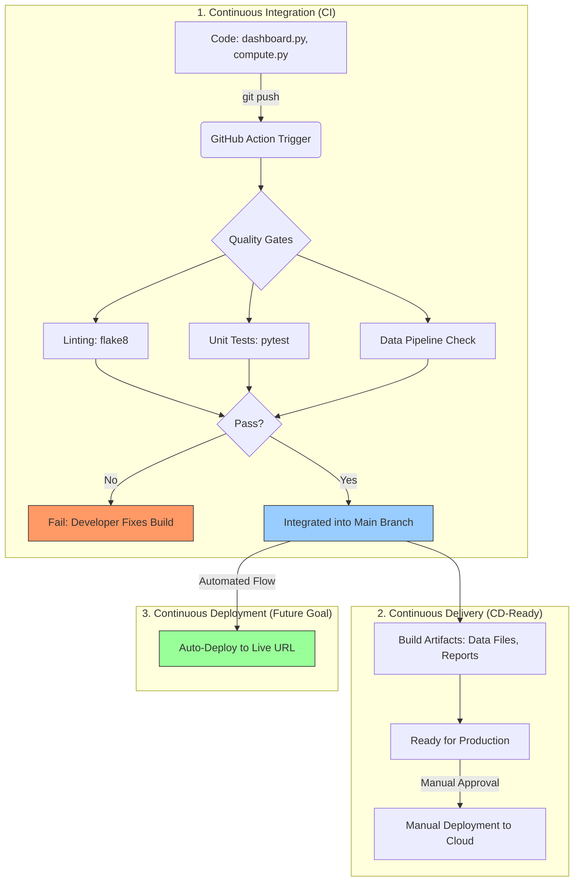

# CI/CD Strategy Overview: Outage Response Analysis

This document explains the **DevOps Lifecycle** implemented in this project, specifically tailored for the **Junior DevOps Engineer** context at UK Power Networks.

---

## 1. Visual Overview

### 🖥️ Text-based Flow (ASCII)
```text
[ Developer ] --(git push)--> [ GitHub Actions ]
                                     |
    +--------------------------------+--------------------------------+
    |                                |                                |
 [ PHASE 1: CI ]              [ PHASE 2: DELIVERY ]          [ PHASE 3: CD ]
 (Automated)                  (Manual Release)               (Automated Deploy)
 |                            |                              |
 |-- flake8 (Lint)            |-- Create Docker Image        |-- Push to Azure 
 |-- pytest (Tests)           |-- Approve Report.md          |-- Go Live!
 |-- Pipeline Check           |                              |
```

### 📊 Professional Render (Mermaid)
> [!TIP]
> If you don't see the diagram below, you can view the fully rendered version on your **GitHub repository** under the Actions or Code tab.



---

## 2. Key Concepts Defined

### 🚀 Continuous Integration (CI)
**Status in this Project: IMPLEMENTED**

CI is the practice of automating the integration of code changes from multiple contributors into a single software project.
*   **The Action**: You push your code to the `main` branch.
*   **The Goal**: Find and fix bugs quicker, improve software quality, and reduce the time it takes to validate new updates.
*   **Our Workflow**:
    1.  **Environment Setup**: Automatically builds a clean Python 3.11 environment.
    2.  **Linting (`flake8`)**: Ensures the code is readable and sticks to professional standards.
    3.  **Testing (`pytest`)**: Verifies that your logic (like median restoration calculations) is accurate.
    4.  **Pipeline Verification**: Runs the actual data generation and cleaning scripts to ensure the "End-to-End" flow works.

### 📦 Continuous Delivery
**Status in this Project: READY (Manual)**

Continuous Delivery is an extension of CI. It ensures that you can release new changes to your customers quickly and in a sustainable way.
*   **The Goal**: To have code that is *always* in a deployable state.
*   **Specific Context**: At UK Power Networks, you might require a human review (from a Senior DevOps lead) of the `REPORT.md` before the new dashboard is published to the company.

### 🛠️ Continuous Deployment
**Status in this Project: OPTIONAL (Future Step)**

This is the fully automated version of Delivery. There is no "Manual Approval" step; if the code passes all CI tests, it goes live immediately.
*   **The Goal**: Total automation and speed.
*   **Benefit**: Users get the latest data insights the second they are ready.

---

## 3. Why this matters for a DevOps Engineer?

1.  **Reliability**: Automated tests catch "silent failures" in metrics before they reach stakeholders.
2.  **Consistency**: It eliminates the **"Works on My Machine"** problem by proving the code runs on a standardized cloud server (Ubuntu).
3.  **Governance**: In a utility company like UK Power Networks, having a clear "Audit Trail" of which tests passed for which version of the code is vital for safety and regulation.

---
*Created for the Outage Response Analysis Project - Junior DevOps Portfolio.*
