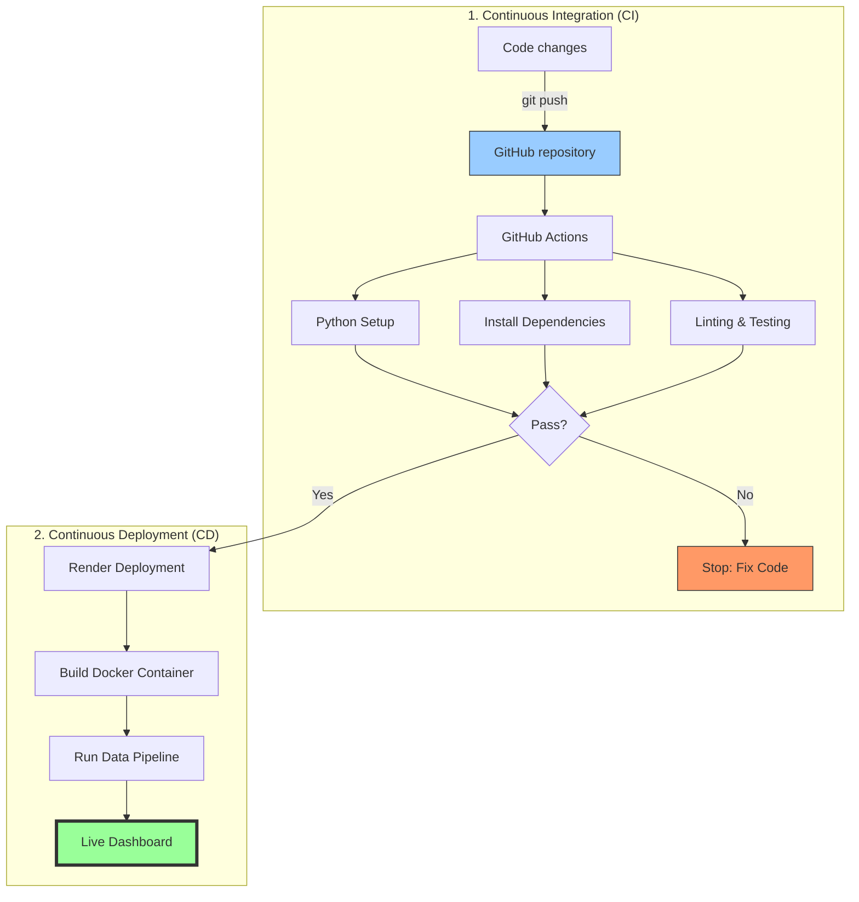
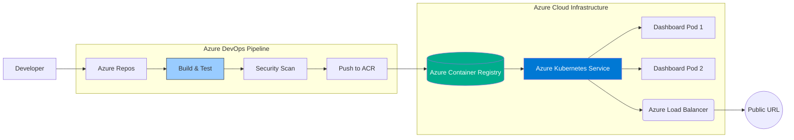

# CI/CD Strategy Overview: Outage Response Analysis

This document explains the **DevOps Lifecycle** implemented in this project, specifically tailored for the **Junior DevOps Engineer** context at UK Power Networks.

---

## 1. Visual Overview

### 🖥️ Text-based Flow (ASCII)
```text
[ YOU ] --(git push)--> [ GitHub Repo ]
                             |
                             |-- (Trigger) --> [ GitHub Actions (CI) ]
                             |                 |-- Linting (flake8)
                             |                 |-- Testing (pytest)
                             |                 |-- Pipeline Check
                             |
                             |-- (Success) --> [ Render (CD) ]
                                               |-- Build Docker Image
                                               |-- Run Pipeline
                                               |-- DEPLOY LIVE! 🚀
```

### 📊 Professional Render (Mermaid)
> [!TIP]
> View the live color diagram here: [GitHub CICD View](https://github.com/shashanksuresh18/power_outage_response-_analysis/blob/main/CICD_OVERVIEW.md)



---

## 2. Key Concepts Defined

### 🚀 Continuous Integration (CI)
**Status in this Project: IMPLEMENTED**

CI is the practice of automating the integration of code changes from multiple contributors into a single software project.
*   **The Action**: You push your code to the `main` branch.
*   **The Goal**: Find and fix bugs quicker, improve software quality, and reduce the time it takes to validate new updates.
*   **Our Workflow**:
    1.  **Environment Setup**: Automatically builds a clean Python 3.11 environment.
    2.  **Linting (`flake8`)**: Ensures the code is readable and sticks to professional standards.
    3.  **Testing (`pytest`)**: Verifies that your logic (like median restoration calculations) is accurate.
    4.  **Pipeline Verification**: Runs the actual data generation and cleaning scripts to ensure the "End-to-End" flow works.

### 📦 Continuous Delivery
**Status in this Project: READY (Manual)**

Continuous Delivery is an extension of CI. It ensures that you can release new changes to your customers quickly and in a sustainable way.
*   **The Goal**: To have code that is *always* in a deployable state.
*   **Specific Context**: At UK Power Networks, you might require a human review (from a Senior DevOps lead) of the `REPORT.md` before the new dashboard is published to the company.

### 🛠️ Continuous Deployment
**Status in this Project: OPTIONAL (Future Step)**

This is the fully automated version of Delivery. There is no "Manual Approval" step; if the code passes all CI tests, it goes live immediately.
*   **The Goal**: Total automation and speed.
*   **Benefit**: Users get the latest data insights the second they are ready.

---

## 3. Why this matters for a DevOps Engineer?

1.  **Reliability**: Automated tests catch "silent failures" in metrics before they reach stakeholders.
2.  **Consistency**: It eliminates the **"Works on My Machine"** problem by proving the code runs on a standardized cloud server (Ubuntu).
3.  **Governance**: In a utility company like UK Power Networks, having a clear "Audit Trail" of which tests passed for which version of the code is vital for safety and regulation.

---

## 4. Enterprise Architecture: Azure + AKS + Azure DevOps

For a large-scale project at a company like **UK Power Networks**, we would move from GitHub/Render to a professional Azure stack.

### 🖥️ Enterprise Flow (ASCII)
```text
 [ YOU ] --(commit)--> [ Azure Repos ]
                            |
                            |-- (Build Pipeline) --> [ Azure DevOps ]                   
                            |                        |-- Run Tests      
                            |                        |-- Build Docker Image
                            |                        |-- Push to ACR (Azure Container Registry)
                            |
                            |-- (Release Pipeline)--> [ AKS (Azure Kubernetes Service) ]
                                                     |-- Rolling Update
                                                     |-- Scaling dashboard pods
                                                     |-- LOAD BALANCER ---> [ LIVE APP ]
```

### 📊 Professional Enterprise Render (Mermaid)



### Key Enterprise Components:
1.  **Azure DevOps Pipelines**: Instead of GitHub Actions, we use professional YAML pipelines that handle build and release separately.
2.  **Azure Container Registry (ACR)**: A private, secure place to store your Docker images.
3.  **AKS (Azure Kubernetes Service)**: This handles "Orchestration." If thousands of users visit your dashboard at once, AKS automatically starts more "Pods" (copies of your container) to handle the traffic.
4.  **Security Scanning**: At the enterprise level, the CI phase would include automated security scans of your Python libraries to ensure no vulnerabilities.

---
*Created for the Outage Response Analysis Project - Junior DevOps Portfolio.*
